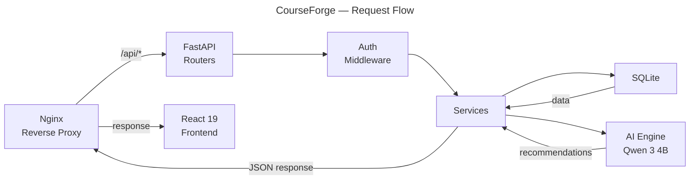

# CourseForge

🏆 **First-Place Winner of MTAHacks 2026** 🏆

Course planning platform for **Université de Moncton** students. Build your schedule, track degree progress, and get AI-powered course recommendations.

## Features

- **Interactive Weekly Calendar** — A visual, dynamic schedule grid (Mon-Fri, 8h-22h) built with Framer Motion. Supports drag-and-drop course blocks, real-time conflict detection, and color-coded courses, giving students absolute clarity on their weekly commitments.
- **Comprehensive Course Catalog** — A sophisticated search interface to browse over 400 active courses across all departments. Includes advanced filtering by prerequisites to eliminate invalid choices before scheduling.
- **Intelligent Program Tracking** — Keep track of degree requirements effortlessly. Currently supporting 63 complex programs with full support for option groups, electives, prefix-based choices, and OFG bank core courses.
- **Real-time Progress View** — Track accumulated, completed, and remaining credits across all active semesters with insightful per-year and per-program breakdowns.
- **AI-Powered Advisor** — Leveraging a local **Qwen 3 4B** AI engine to generate hyper-personalized course recommendations based on the user's major, minor, completed credits, and even schedule density preferences.
- **Multi-Session Planning** — Plan long-term by organizing courses seamlessly across Hiver, Printemps-Ete, and Automne 2026 sessions.
- **User Accounts & Persistence** — Full registration & login, enabling students to securely save their schedule configurations, set their major/minor combinations, and pick up right where they left off.

## Why CourseForge?

University scheduling is traditionally a stressful, manual process requiring students to cross-reference static PDFs, check prerequisites manually, and guess which courses fit together without overlapping. 

**CourseForge** solves this beautifully. Born from the minds of **Université de Moncton** students at **MTAHacks 2026** (taking **1st Place**), this project aims to demystify course planning for our peers. Whether it's mapping out a complex major/minor requirement or just finding an elective that fits a tightly packed Tuesday, CourseForge's combination of a smooth UI and intelligent backend AI makes registration seamless.

## Tech Stack

| Layer    | Technology                          |
|----------|-------------------------------------|
| Frontend | React 19, Vite 8, Framer Motion    |
| Backend  | FastAPI, SQLite, Uvicorn            |
| Deploy   | Docker, Nginx                       |

## Architecture



## Project Structure

```
CourseForge/
├── Frontend/
│   ├── src/
│   │   ├── App.jsx                  # Main app, routing, state management
│   │   ├── App.css                  # All styles
│   │   ├── components/
│   │   │   ├── LoginScreen.jsx      # Auth UI
│   │   │   ├── CourseCatalog.jsx    # Course browser/search
│   │   │   ├── ScheduleGrid.jsx     # Weekly calendar view
│   │   │   ├── ProgramView.jsx      # Degree requirements display
│   │   │   ├── ProgressView.jsx     # Credit progress tracker
│   │   │   └── AIAdvisor.jsx        # AI recommendation panel
│   │   └── data/
│   │       └── api.js               # API service layer
│   ├── public/
│   │   ├── programs.json            # 63 program definitions with option groups
│   │   ├── schedule_hiver_2026_moncton_fix.json
│   │   ├── schedule_printemps_ete_2026_moncton_fix.json
│   │   └── schedule_automne_2026_moncton_fix.json
│   ├── Dockerfile
│   └── nginx.conf
├── Backend/
│   ├── main.py                      # FastAPI app entry point
│   ├── config.py                    # DB path, CORS origins
│   ├── database.py                  # SQLite connection + schema
│   ├── seed.py                      # Course data seeder
│   ├── models/                      # Pydantic request/response models
│   ├── routers/                     # API route handlers
│   │   ├── auth.py                  # POST /api/register, /api/login, GET/PUT /api/me
│   │   ├── courses.py               # GET /api/courses, /api/departments
│   │   ├── schedules.py             # GET/POST /api/schedule
│   │   └── recommendations.py       # POST /api/ai/recommend
│   ├── services/                    # Business logic
│   ├── data/                        # Seed data (courses.json)
│   ├── requirements.txt
│   └── Dockerfile
├── docker-compose.yml
└── LICENSE                          # GPL-3.0
```

## Getting Started

### Docker (recommended)

```bash
docker compose up --build
```

- Frontend: http://localhost:3000
- Backend: http://localhost:8000

The frontend nginx proxies `/api/` requests to the backend internally, so only the frontend port needs to be exposed/tunneled.

### Local Development

**Backend:**

```bash
cd Backend
python -m venv venv
source venv/bin/activate
pip install -r requirements.txt
uvicorn main:app --reload
```

Runs on http://localhost:8000

**Frontend:**

```bash
cd Frontend
npm install
npm run dev
```

Runs on http://localhost:5173. In dev mode, API calls go to `http://localhost:8000` by default. Override with:

```bash
VITE_API_URL=http://your-backend:8000/api npm run dev
```

## API Endpoints

| Method | Endpoint            | Auth | Description                    |
|--------|---------------------|------|--------------------------------|
| POST   | `/api/register`     | No   | Create account                 |
| POST   | `/api/login`        | No   | Login by email                 |
| GET    | `/api/me`           | Yes  | Get current user               |
| PUT    | `/api/me`           | Yes  | Update major/minor             |
| GET    | `/api/courses`      | No   | List all courses               |
| GET    | `/api/departments`  | No   | List departments               |
| GET    | `/api/schedule`     | Yes  | Load saved schedule            |
| POST   | `/api/schedule`     | Yes  | Save schedule                  |
| POST   | `/api/ai/recommend` | Yes  | Get AI course recommendations  |

## Environment Variables

| Variable       | Default              | Description               |
|----------------|----------------------|---------------------------|
| `DB_PATH`      | `courseforge.db`     | SQLite database file path |
| `VITE_API_URL` | `/api`               | Backend API base URL      |

## License

GPL-3.0 - See [LICENSE](LICENSE) for details.
